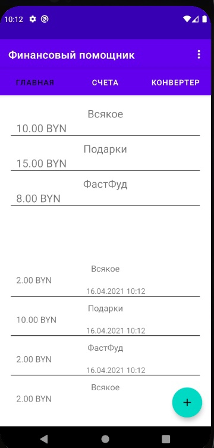
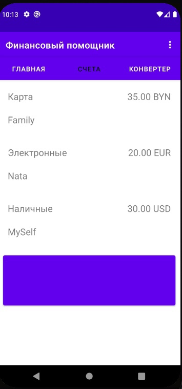
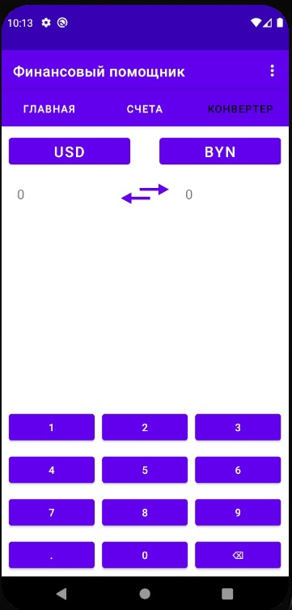
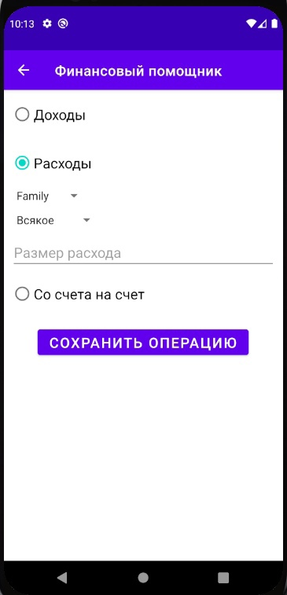

# FinancialAssistant

Данный проект я все еще пишу в качестве диплома. Он представляет собой финасновый менеджер, помогающий пользователю следить за своими расходами и доходам. Проект еще сырой,
нет даже БД. Фронт пока работает чисто для тестов, но это лучший вариант для оценки бэкенда.

# На данный момент работают:
- добавление операций расходов, доходов, переводов;
- добавление и изменение счета;
- конвертер валют. Данные обновляются при заходе пользователя в приложение;
- добавление категорий расходов;
- изменение категорий расходов;

# В планах:
- подробная статистика расходов и доходов;
- запланированные платежи;
- долги;
- уведомления;
- виджет.

​
​
​
​
​